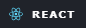

<h1 align="center"> PROJECT FRONTEND: RETROLINK </h1>

<image src="./img/ReadmeImageTop.png" alt="RetroLink">

---

## Table of Contents :file_folder:

1. [Description :classical_building:](#description-classical_building)
2. [Stack :gear:](#stack-gear)
3. [Project :open_book:](#Project-open_book)
4. [Future functionalities :star2:](#Future-functionalities-star2)
5. [Link :dart:](#link-dart)
6. [Author :wave:](#author-wave)
7. [Acknowledgments :sparkling_heart:](#acknowledgments-sparkling_heart)

---

## Description :classical_building:

etroLink is a social networking platform tailored for retro video game enthusiasts. Built with React, this platform aims to connect gamers from around the world who share a passion for classic titles, consoles, and the nostalgia of gaming's golden era. Dive into discussions, share your favorite retro gaming moments, and discover new games and communities that celebrate the timeless charm of vintage gaming. Whether you're a seasoned gamer or new to the retro scene, RetroLink offers a vibrant space to connect, engage, and relive the magic of retro gaming.

---

## Stack :gear:
      


---

## Project :open_book:

### 1 - Local Installation:

<h4>BackEnd</h4>

- Go this root: https://github.com/MartaGBayona/project_BACKEND2.git

- Clone repository.

    ``npm install``.

- Start Docker.

- Start MongoCompass.

- Fill .env file with the corresponding data.

    ``npm run dev``.

    ``npm run run seed``.

- Copy the data from MongoCompass and connect.

- Import file Collection_SocialMLocal (folder HTTP) for Thunder Client

<h4>FrontEnd</h4>

- Clone this repository.
    `npm install`.
    `npm run dev`.
- Access localhost from the console view.

### 2 - Info to log 

- Super_admin:
```
_id: "65eb741d9e2ac607835397d0",
name: "superAdmin",
email: "superAdmin@superAdmin.com",
password: 123456,
role: "super_admin"
```

- Admin:
```
_id: "65eb74259e2ac607835397d3",
name: "admin",
email: "admin@admin.com'",
password: 123456,
role: "admin"
```

- User:
```
_id: "65eb742b9e2ac607835397d6",
name: "'user'",
email: "user@user.com'",
password: 123456,
role: "user"
```

### 2 - Roots:

1. Home:


<image src="./img/ReadmeImageTop.png" alt="Home">


2. Posts: 
The superAdmin manages the posts from the same Posts page, having exclusive access to a button to delete the posts

<image src="./img/Posts.png" alt="Posts">

3. Detail Post: 

<image src="./img/DetailPost.png" alt="Detail Post">

4. Profile

<image src="./img/Profile.png" alt="Profile">


5. New Post: 

It's on the same view as the posts

<image src="./img/NewPost.png" alt="NewPost">


6. Users(only super_admin):


<image src="./img/Users.png" alt="Users">


7. Log:

<image src="./img/Log.png" alt="Log">


8. Register:

<image src="./img/Register.png" alt="Register">


---

## Future functionalities :star2:

- More comprehensive user registration

- Modification of more parameters in the user profile

- Allow super admin to  modify users and posts

- Create dropdown in header and cards

- Add images to backend services and add to frontend

- Footer design

- Responsive design

- Fronted


---

## Link :dart:

https://github.com/MartaGBayona/projectFrontendII

---

## Author :wave:

- **Marta Gimeno Bayona**
- [GitHub](https://github.com/MartaGBayona) - [LinkedIn](https://www.linkedin.com/in/martagbayona/)

---

## Acknowledgments  :sparkling_heart:

My most sincere thanks to all my colleagues. Especially to [<i class="fab fa-github"></i> Pedro](https://github.com/Eryhnar), [<i class="fab fa-github"></i> Marina](https://github.com/marinaescriva), [<i class="fab fa-github"></i> Ana](https://github.com/ariusvi), [<i class="fab fa-github"></i> Fran](https://github.com/FRR95) and [<i class="fab fa-github"></i> Carlos](https://github.com/CariblaGIT) for their invaluable help and support.
